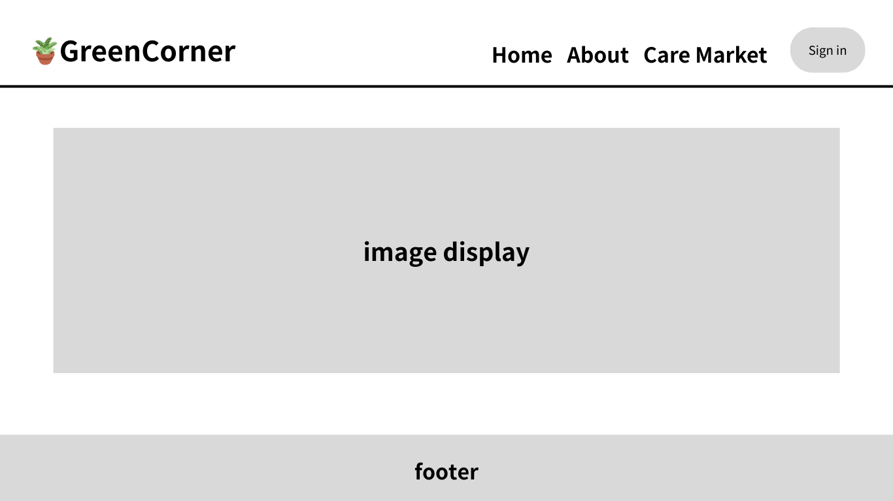
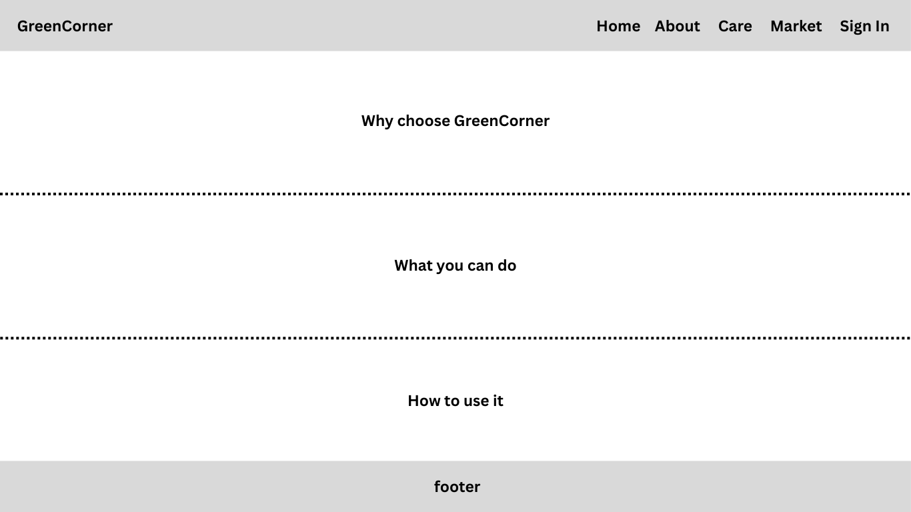
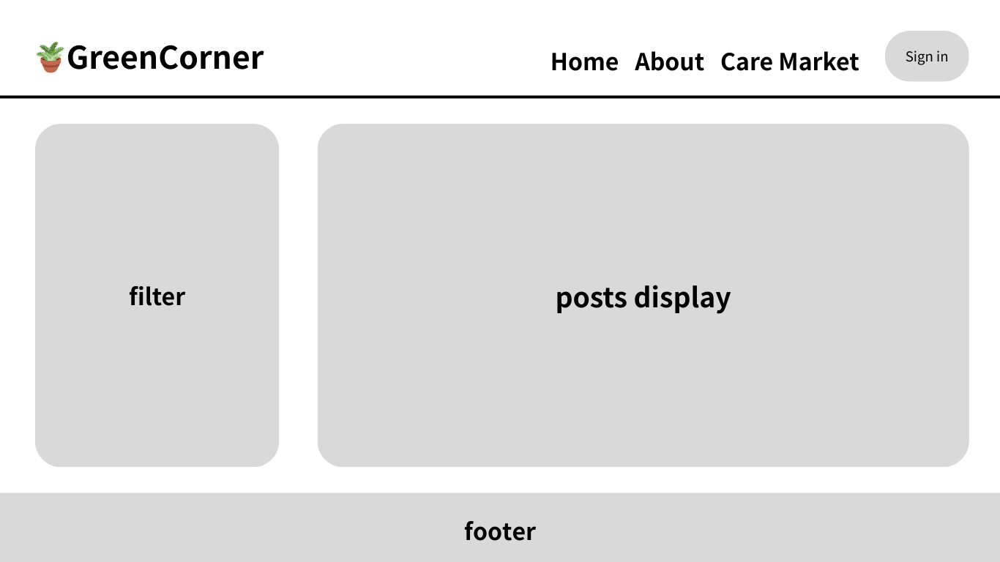
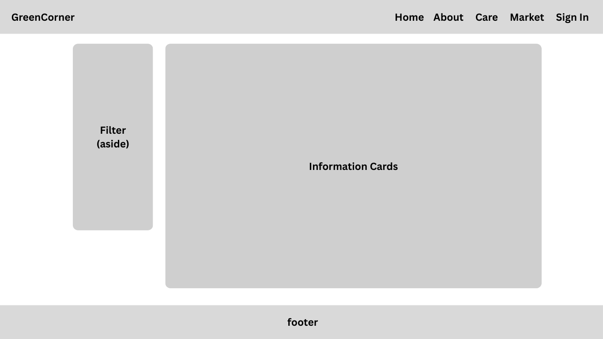
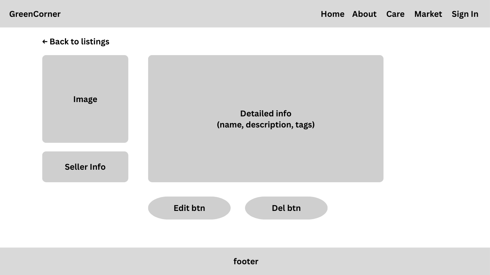
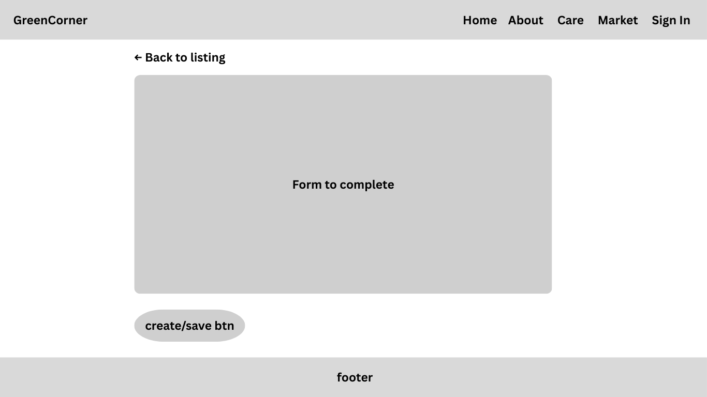

# GreenCorner Design Document

## Members

- Jiahui Zhou
- Yi-Peng Chiang

## Project Description

GreenCorner is a community platform for plant lovers to both share plant care knowledge and exchange plants locally. Many beginners struggle to find practical advice for watering, lighting, propagation, and plant health, while experienced plant owners often have extra plants, cuttings, or unwanted pots they want to sell, give away, or rehome. GreenCorner brings these two needs together in one space. Users can post plant care guides and tips for others to learn from, while also creating plant listings for sale, free adoption, or rehoming. The platform is designed as a lightweight, community-first alternative to both generic marketplaces and plant reminder apps.

## Project Objective

- Help beginners find trustworthy, community-sourced plant care advice
- Allow experienced plant owners to share care knowledge through posts
- Enable users to list plants for free adoption, sale, or rehoming
- Connect budget-conscious plant lovers with affordable or free local plants
- Provide a lightweight, focused alternative to generic marketplaces and reminder apps

## Core Features

### Plant Care Posts

- Browse and filter care posts by plant type, difficulty level, and tags
- Read full care guides covering watering, lighting, propagation, and troubleshooting
- Create, edit, and delete your own care posts
- Mark posts as beginner-friendly or low-maintenance for easier discovery

### Plant Listings

- Browse plant listings with filtering by plant type, price range, condition, listing type, and availability status
- View detailed listing pages showing full description, plant condition, and seller contact info
- Create listings marked as free, for sale, or rehoming
- Edit and delete your own listings
- Listings seeded with 1000 entries across 6 plant categories for a rich browsing experience

## User Personas

1. **Beginner Plant Owner** — Wants simple, trustworthy advice for keeping houseplants alive.
2. **Experienced Plant Enthusiast** — Wants to share care knowledge and plant care tips with others.
3. **Moving or Downsizing Plant Owner** — Wants to sell, give away, or rehome plants when they no longer have space or time to care for them.
4. **Budget-Conscious Plant Lover** — Wants affordable or free plants from a local plant community.

## User Stories

### Yi-Peng Chiang — Plant Care Posts

1. As a plant owner, I want to create a care post with plant type, lighting, watering, and care tips, so I can share useful knowledge with others.
2. As a plant owner, I want to view, edit, and delete my care posts, so I can keep my content accurate and updated.
3. As a beginner, I want to browse care posts filtered by plant type, care difficulty, and tags, so I can find advice that matches my needs.
4. As a user, I want to read posts about common problems like overwatering, pests, or yellow leaves, so I can learn from other people's experience.
5. As a plant enthusiast, I want to mark posts as beginner-friendly or low-maintenance, so new plant owners can find helpful content more easily.

### Jiahui Zhou — Plant Listings

1. As a plant owner, I want to create a plant listing with plant type, condition, price, and location, so I can sell or rehome my plant.
2. As a plant owner, I want to mark a listing as free, for sale, or rehoming, so I can clearly show what kind of exchange I want.
3. As a seller, I want to view, edit, and delete my listings, so I can manage my available plants.
4. As a buyer, I want to browse plant listings filtered by plant type, price, location, and status, so I can find plants that fit my budget and interest.
5. As a student, I want to find low-cost or free plants nearby, so I can grow my collection affordably.

## Design Mockup

### Home

---

### About

---

### Care Posts

---

### Market Listings

---

### Market Listing - detailed page

---

### Market Listing - create/edit form

